Note: Regarding the ConnectedOfficeContext in the DevicesController please refer to the Data Access Layer section below  
The code of the Web App was provided by the lecturer due to the project focusing on Standards & Patterns, 
the code that was changed by the student to successfully complete this project is in the controller classes, 
Startup.cs and apppsetinggs.json(that is hidden in .gitignore). Further, the student created a folder named 
Repository to implement a tier 2 repository pattern, meaning all my controller repositories inherit from one 
interface that fulfils all the SOLID principles. The student created very custom methods for the GenericRepository 
which is worth checking out, the custom methods minimize the amount of code that needs to be repeated and maximise 
reusability(considering the dependency inversion principle). Nevertheless, a section will still be discussed on how 
to use the Web App:  
<h2>How to use the Web App</h2>

	In order to use the Web App of student 34494847 the user needs to click this link: <a href="https://webapp-34494847.azurewebsites.net/">WebApp-34494847</a>.
	Once the web page has landed, the user will be greeted with the following banner:  
	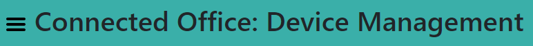 
	The user then needs to specify the specific controller in the URL to use its endpoints. For example, if the user wants to use the category controller, then 
	the URL would be specified like this which is the same for devices and zones:  
	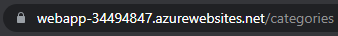 
	After specifying the specific controller in the URL that wants to be used, the user will see a page like this which is also similar for devices and zones:  
	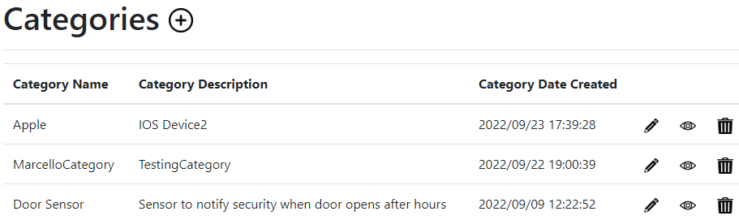 
	The user can then choose to edit, view or delete an existing record or create a new record by clicking these icons:  
	Edit:  
	 
	Which then gives this page:  
	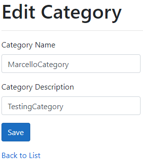 
	View:  
	 
	Which then gives this page:  
	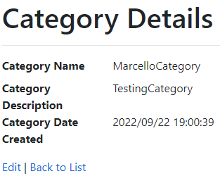 
	Delete:  
	 
	Which then gives this page:  
	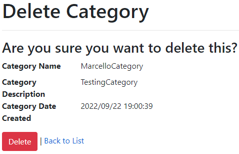 
	Create:  
	 
	Which then gives this page:  
	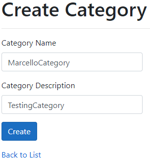 
	And that's it, the user can access any of these endpoints for categories, devices and zones in the Web App of student 34494847

<h2>Data Access Layer</h2>

	The ConnectedOfficeContext is only referenced in the GenericRepository class, except at the DevicesController about which I consulted Prof Marijke Coetzee 
	on 2022/09/20 in class and we established that I must use the ConnectedOfficeContext in the DevicesController for the ViewData render (dropdown on the webpage) 
	and she said I will not be penalized for this. The student used the .json file that was provided by the lecturer which means that the student used a connection 
	string to an online database that the lecturer is hosting. Lastly, all SOLID principles were successfully applied as discussed previously, meaning that data was not 
	accessed directly from each controller.

<h2>Repository Layer</h2>

	The student has successfully implemented all classes and interfaces:  
	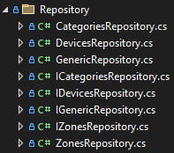 
	For which dependency injection was done in the Startup.cs file:  
	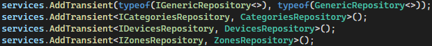

<h2>Standards</h2>

	All SOLID principles were successfully applied as discussed previously. No code was repeated due to the student creating custom methods in the generic repository 
	which was also discussed previously. Both the single responsibility principle and the open-closed principle were applied due to successfully applying SOLID. The 
	student provided short but very descriptive commented annotations at each method in each controller and at some classes to explain the inheritance(where does the 
	class come from). The student removed any non-essential commented-out code and as said previously only provided short but very descriptive commented annotations to 
	essentially provide clean code and not bombard the classes with commentary. The student applied the dependency inversion principle which means that changes in one 
	class should not force other classes to change, so the whole application can become maintainable and extensible. This was done by carefully designing custom methods in 
	the GenericRepository as discussed previously.

<h2>Hosting</h2>

	The Web App is hosted on the student's Microsoft Azure account. The Web App can be accessed over the internet anywhere in the world by clicking: 
	<a href="https://webapp-34494847.azurewebsites.net/">WebApp-34494847</a>. Student 34494847's resource group includes the following:  
	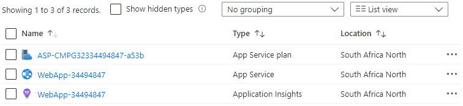

<h2>Scrum Implementation</h2>

	The student has successfully kept his GitHub board updated throughout Project 3 as the board was set up in Project 1. Also, the student's Project 3 repository is 
	linked to his GitHub board and a lot of effort was done to link the exact repositories of each Project that was done and what must be done to each task (Repository 
	and Linked Assessment fields). There was a stretch task created being creating custom methods for the GenericRepository due to how unexpectedly long it was taking so 
	it was not just a quick task and was worth adding. Luckily, the stretch task was successfully finished ahead of the project milestone. 
	 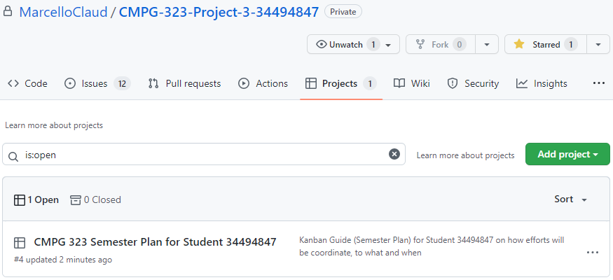

<h2>Source Control</h2>

	The student added Project 3 to his GitHub profile on day 1 and every change that has been decided to commit was committed. The branching strategy that was set up in 
	Project 1 was followed to the T which demonstrated an iterative use of GitHub throughout Project 3 to successfully manage version control of the project. The student 
	also did a lot of effort in providing a very well laid out README.md file by explaining everything possible to make it easier for the person trying to figure everything out. 
	 The student started developing Project 3 on Sep 18, 2022:  
	 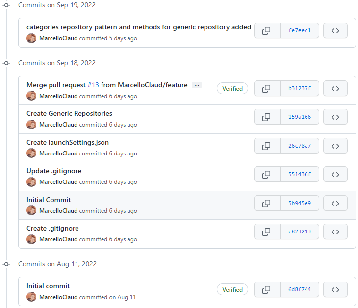 
	The student also has made extensive use of the .gitignore file to hide any type of file that contains credentials and sensitive information. This includes files such as 
	appsettings.json, azure publish profiles etc: 
	 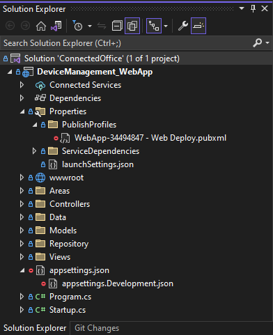

<h2>Reference List</h2>

	The student provided a reference list with over 30 references on the Project 3 repository and the submission form. Only websites that were relevant and actually useful to 
	produce this successful project were referenced. I have found that the <a href="https://stackoverflow.com/">Stack Overflow</a> site was the most useful.

