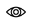

Note: The code of the Web App was provided by the lecturer due to the project focusing on Standards & Patterns, the code
that was changed by the student to succesfully complete this project are in the controller classes, startup.cs and apppsetinggs.json(that is hiddon in .gitignore).
Furtherly, the student created a folder named Repostory to implement a tier 2 repository pattern which means all my controller repositories inherit from one interface which fullfils all the SOLID principles. 
The student created very custom methods for the generic repository which is worth checking out, the custom methods minimizes the amount of code that need to be repeated and maximises reuseability. 
Nevertheless, a section will still be discussed on how to use the Web App:   
<h2>How to use the Web App</h2>

	In order to use the Web App of student 34494847 the user needs to click this link: <a>WebApp-34494847</a>
	Once the web page has landed, the user will be greeted with the following banner:  
	  
	The user then needs to specify the specific controller in the URL to use its endpoints.
	For example, if the user want to use the category controller, then the URL would be specified like this which is the same for devices and zones:  
	  
	After specifying the specific controller in the URL that wants to be used, the user will see a page like this which is also similar for devices and zones:  
	  
	The user can then choose to edit, view or delete an exting record or create a new record by clicking these icons:  
	Edit:  
	  
	Which then gives this page:  
	  
	View:  
	  
	Which then gives this page:  
	  
	Delete:  
	  
	Which then gives this page:  
	  
	Create:  
	  
	Which then gives this page:  
	  
	And that's it, the user can access any of these endpoints for categories, devices and zones in the Web App of student 34494847

